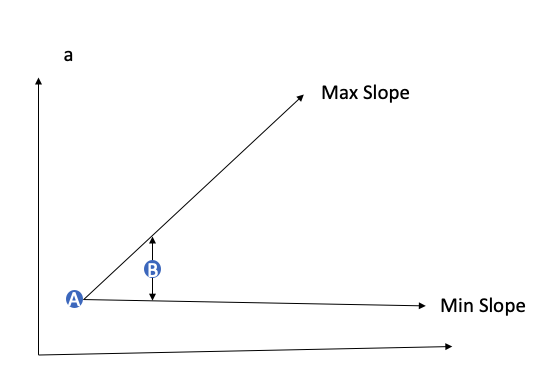

# 有损压缩

# 背景介绍

为保证数据的正确，现有海东青数据库都使用无损压缩，但是对于工业数据库使用场景，需要提高压缩率，可以容忍有损压缩。减小磁盘压力。

# flat压缩算法


流程介绍：

1. 初始化时选取第一个点(A)为curr点为flat压缩判断的基准点，存储在数据库中。
1. 相对curr点计算一个deadband区域，上图中的黄色区域
1. 迭代新的点(B)，判断点是否在deadband区域内。如果在区域内跳转到4， 不在区域内跳转到5。
1. 将last置为B，跳转到3
1. 将last点存储，然后清空last点。将curr置为当前点并且存储当前点，重新计算deadband区域。跳转到3。


在上图中，可以看到E点不在A的deadband内，所以需要把D和E点存储，并且把E点作为新一轮迭代的基准点。H点不在E的deadband内，需要存储G点和H点，并且将H点作为新一轮迭代的基准点。最后A,D,E,G,H会被存储，其余点都会被丢掉。

# 旋转门算法



流程介绍：

1. curr点(A)为一轮旋转门压缩判断的基准点，稳定会存储在数据库中。
1. 然后迭代第一个点(B)，此时计算curr点相对于B点的上边界点和下边界点的斜率，也就是图中的Max Slope 和Min Slope，将last置为B点.
1. 继续迭代(C)，此时先计算(C)是否处于Max Slope 和Min Slope之间。 如果在区域内跳转到4， 不在区域内跳转到5。
1. 更新last为当前点，更新Max Slope和Min Slope。跳转到3。
1. 更新curr为last点，存储curr点，更新last点为当前点，重新计算Max Slope和Min Slope。跳转到3。


在上图中，A点是本轮的基准点，可以发现B,C,D点都在Max Slope 和Min Slope之间。F点不在此区间，此时将D点保存，并且将D点置为基准点，F点为last点，重新计算Max Slope 和Min Slope，所以最后A，D点会保留，其余点会被丢弃。

# 使用方式

## 配置管理

在config配置文件中与有损压缩相关的参数

```TOML
[data]
  // 配置是否开启整个数据库是否开启有损压缩
  lossy-compression-enabled = bool
  // 当开启有损压缩后，配置是否需要在有损压缩前对数据按照时间排序
  sort-before-write-enabled = bool
  // 是否开启超前点处理，不开启的时候，历史数据直接存储。
  advance-point-resolve-enabled = bool
```

## 设置有损压缩语法

```sql
ALTER LOSSY COMPRESSION ON [DATABASE db_name] [RETENTION POLICY rp_name] [MEASUREMENT m_name] [SERIES s_name]
(COMPTYPE <string>, DISABLE) [COMPDEV <float>] [COMPPERCENT <float>] [COMPMAX <duration>] [COMPMIN <duration>] [COLUMN <string>] 
例:

ALTER LOSSY COMPRESSION ON DATABASE db1 COMPTYPE 'sdt' COMPDEV 1.0
ALTER LOSSY COMPRESSION ON DATABASE db1 DISABLE
ALTER LOSSY COMPRESSION ON DATABASE db1 MEASUREMENT m1 COMPTYPE 'float' COMPDEV 1.0 COMPMAX 1d
ALTER LOSSY COMPRESSION ON DATABASE db1 MEASUREMENT m1 SERIES 't1=ww,t2=ss' COMPTYPE 'sdt' COMPDEV 1.0
```

参数介绍：

|参数名 |参数类型 | 备注|
| ----------- | ----------- |----------- |
|compType | string | 有损压缩算法指定(flat/sdt)|
|compDev |float |有损压缩的容忍度(绝对值)|
|compPercent| float |容忍度占数据的value的百分比，只有当compDev未设置时，这个参数才起作用|
|compMax |duration | 一个有损压缩batch最大的时间范围，超过这个时间间隔之后的点，无条件保留|
|compMin |duration | 最近两个存储点的最小时间间隔，如果两个存储点间隔小于此值，直接丢弃|
|column | string | 当一个series对应多个列的时候，需要指定哪一个为有损压缩的基准列。|
|disable |不用填值 | 是否关闭有损压缩|

## 有损压缩信息查询

```SQL
SELECT * FROM _fctsdb.autogen.lossy_compression [where_clause]
```


