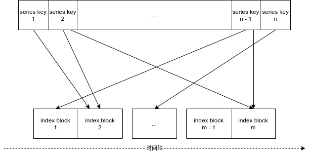
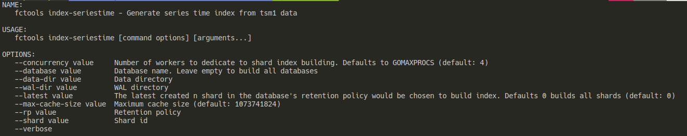

# 时间索引

时序数据库通常需要处理较多的时间范围查询，为了加速小时级别的时间范围的查询性能，在已有按照时间进行数据分区的基础上，在每个 Shard 内引入一个时间索引。



由于一个时间分区的长度固定，在时间轴上将一个 Shard 的时间按照小时为粒度划分为若干个索引块。根据时序数据点的时间点，对应索引块存储写入数据点的 series key。在数据的写入过程中，相应的索引块也进行更新。索引块和数据点 series key 之间的是多对多的关系，同一个 series key 可能在不同的时间点出现多次，不同的 series key 也可以出现在相同的时间段。

# 适用场景

开启时间索引会引入一定的计算和存储开销，是否开启本功能可根据以下2个原则进行判断：

1. series key 在时间分布上较为稀疏，每个小时内出现的 series key 占总体较小部分
1. 对于小时级别的时间范围查询性能较为敏感

在满足以上条件，开启时间索引的情况下，形如 `SELECT [field_name] FROM [measurement_name] WHERE time >= [t1] AND time <= [t2]` 的时间范围查询速度可以得到可观的提升。

# 使用方法

## 开启时间索引

在配置文件中打开时间索引开关，默认为关闭状态：

```toml
[data]
  series-time-index-enabled = true
```

## 历史数据构建索引（可选）

对于打开时间索引前就存在的历史数据，无法利用时间索引进行加速。如有需要，可通过 fctools index-seriestime 工具离线进行索引构建，具体的参数说明如下。




