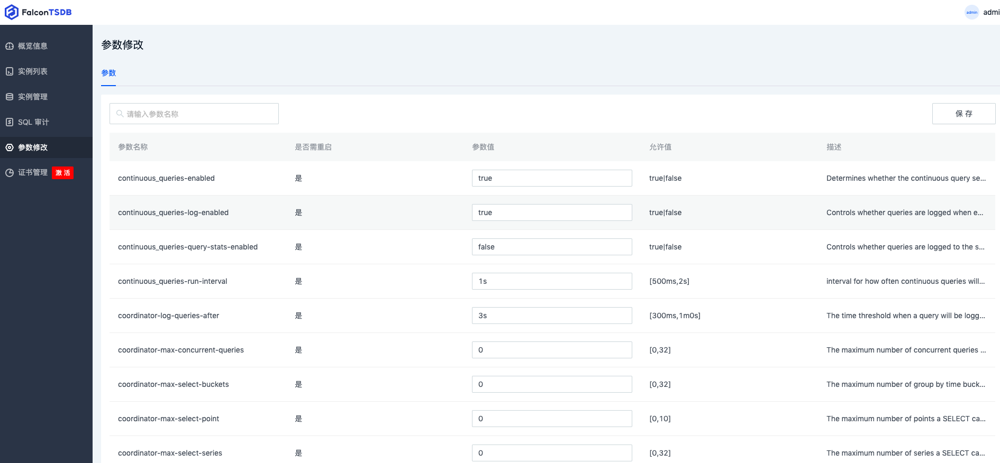

# 参数配置

海东青时序数据库提供**配置文件**进行部分参数配置，其余参数则由**系统变量**功能和**环境变量**进行配置。

> 注意：配置文件中的部分参数也被注册到系统变量功能中，因此这部分参数配置可同时由配置文件和系统变量进行修改


# 配置文件

```TOML
[meta]
  # 数据库meta文件的存放目录
  dir = "/data/fctsdb/meta/.fctsdb/meta"
  # 是否在创建数据库时自动创建其默认RP过期策略
  retention-autocreate = true

[data]
  # 数据库的数据文件的存放目录
  dir = "/data/fctsdb/meta/.fctsdb/data"
  # 存放数据库全量同步时的快照文件
  snapshot-dir = "/data/fctsdb/meta/.fctsdb/snapshot"
  # 指定数据库索引的类型， tsi1为采用文件作为储存的倒排索引，inmem则为使用内存的倒排索引
  index-version = "tsi1"
  # 是否开启时间索引, 此选项一旦配置不能再修改，否则会出现查询结果错误
  series-time-index-enabled = false
  # 指定数据库wal日志的存放路径
  wal-dir = "/data/fctsdb/meta/.fctsdb/wal"
  # 是否开启query日志，若为true则会在开始执行查询时记录日志。
  query-log-enabled = false
  # 是否开启延时加载
  lazy-loading-enabled = false
  # 当开启延时加载时，配置立即加载的shard数量
  hot-shards = 5
  # 是否开启有损压缩
  lossy-compression-enabled = false
  # 是否在写入数据前对数据按照时间排序
  sort-before-write-enabled = false
  # 当开启有损压缩时，是否开启超前点处理
  advance-point-resolve-enabled = false

[rpc-server]
  # 主从同步、备份恢复的grpc服务监听地址
  bind-addr = "127.0.0.1:8090"
  # grpc通信是否开启tls，若开启，则使用security中tls配置
  tls-enable = false

[oplog-replica]
  # 设置当前实例的角色，leader为主节点，follower为从节点
  role = "leader"
  # 数据写入完成所需要复制的最少节点数
  min-isr = 1
  # 是否开启主从复制
  replica-enabled = true
  # 高可用集群节点配置
  cluster-addrs = []

[coordinator]

[memcontrol]
  # 是否开启内存限制功能
  enabled = true
[subscriber]
  # 是否跳过SSL安全检测
  insecure-skip-verify = false

[http]
  # 是否开启HTTP API服务
  enabled = true
  # 数据库API服务器的监听地址
  bind-address = ":8086"
  # 是否开启pprof
  pprof-enabled = true
  # pprof监听地址
  pprof-bind-address = "localhost:6060"
  # 是否开启HTTP/HTTPS访问日志
  log-enabled = false
  # 是否禁止write请求的日志打印
  suppress-write-log = true
  # 是否开启HTTPS通信
  https-enabled = false
  # 是否启用UNIX域socket
  unix-socket-enabled = false
  # UNIX socket的权限
  unix-socket-permissions = "0777"
  # UNIX socket的文件路径
  bind-socket = "/var/run/fcstdb.sock"
  # HTTP/HTTPS API服务器的访问日志路径，如果为空则使用logging配置的日志
  access-log-path = ""

[mysql]
  # MySQL协议服务绑定的监听地址
  bind-address = ":9000"
  concurrent-count = 500
  # 是否开启MySQL协议服务
  enabled = true
  max-conn-count = 1000
  wait-timeout = 9000
  [mysql.performance]
    tcp-keep-alive = true
    tcp-no-delay = false
  [mysql.security]
    # 是否要求安全传输, 若开启，则需要配置安全证书，若没有配置则使用security中的tls配置
    require-secure-transport = false
    ssl-ca = ""
    ssl-cert = ""
    ssl-key = ""
    
[logging]
  # 日志的格式。支持 "json"、"console", "logfmt", "auto
  format = "auto"
  # 日志级别, 支持"debug", "info", "warn", "error", "dpanic", "panic", "fatal"
  level = "info"
  # 是否禁止在启动时输出LOGO
  suppress-logo = false
  # 是否启用日志输出到文件
  enable-log-to-file = false
  # 日志文件的路径，仅当enable-log-to-file为true时有效
  filename = ""
  # 请求的监控日志，以及慢日志的路径
  monitor-log = ""
  # 单个日志文件的最大大小（MB）
  max-size = 1024
  # 日志最大保留天数
  max-days = 7
  # 日志最大备份数
  max-backups = 7

[security]
  # HTTP/HTTPS API服务器是否开启安全模式，在安全模式下不会启用auth认证
  safe-mode-enabled = false
  [security.encryption]
    # 指定存层数据加密算法提供方,可选"software"、"hardware"，若为空则表示不开启储存层数据加密
    provider = ""
    # 指定数据加密的主密钥公钥
    public-key = ""
    # 如果加密算法由软件提供，则配置type和path指定如何获取私钥
    type = ""
    path = ""
  [security.tls]
    # TLS相关配置，若HTTP和GRPC服务开启SSL则会使用此配置
    min-version = ""
    max-version = ""
    ca-path = ""
    cert-path = ""
    key-path = ""
    verify-peer = false
    insecure-verify = false

[license]
  # 授权License文件的路径，若为空或路径无效，则海东青数据库以试用版模式启动
  license-path = ""
```

# 系统变量

## 系统变量类型

系统变量会被持久化，根据持久化的位置类型分类，可将系统变量分为如下两种类型：

1. **Config**

此类型变量只储存在配置文件中，即此类型参数可以在启动数据库之前直接修改配置文件进行配置，数据库实例启动后，变量的值就是配置文件里配置的值。

在系统运行时可以对此类型变量进行修改，此时变量的值即为新修改的值，且涉及的功能会立即采用新修改的值而生效，即不需要重启数据库实例。

并非所有此类型变量均可在运行时修改后持久化到Config配置文件。

注意：只有Config文件中部分配置项被注册到系统变量中。

2. **Meta**

此类型变量只储存在meta二进制文件中，无法通过配置文件来配置，仅能通过系统变量功能进行配置。此类型变量的初始值在代码中定义。

在系统运行时可以对此类型变量进行修改，所有修改的值都会立即持久化到meta二进制文件中，在重启数据库实例后会加载meta文件以应用修改后的值。

并非所有此类型变量的修改都会立即生效，因此若需生效则需重启数据库服务。


## 设置系统变量


1. 通过控制台设置

登陆控制台后点击左侧导航栏的`参数修改` ，然后在右边列表里可以通过编辑需要修改的系统变量对应的 `参数值` ，然后点击右上角的 `保存` 即可完成修改。



2. 通过fcshell设置

通过fcshell访问海东青数据库，然后在交互式模式下执行命令即可完成修改。

命令格式为：`SET VARIABLE "variable_name" = variable_value`。

注意：当variable_value为字符串时需要用单引号括起来。

例如：

```Shell
SET VARIABLE "data-query-log-enabled" = false
SET VARIABLE "data-cache-max-memory-size" = 1024
SET VARIABLE "data-compact-full-write-cold-duration" = '1h30m'
SET VARIABLE "oplog-replica-clearup-max-size" = '3g'
```

## 查询系统变量

可以使用控制台或fcshell查询当前系统的系统变量。

1. 通过控制台查询

在控制台的左侧栏点击“参数修改”即可分页显示所有的系统变量


2. 通过fcshell查询

查询所有系统变量：
`SHOW VARIABLES`

查询指定名称的系统变量：
`SHOW VARIABLES WHERE var_name = 'security-login-failure-lock-auth-interval'`

注意：var_name并不是变量名称，不可修改它

## 系统变量列表

|变量名| 变量说明  |是否立即生效(为空则为否)|
| ----------- | ----------- |----------- |
|logging-level |日志级别，可选：debug、info、warn、error（立即生效）| 是|
|data-query-log-enabled | 是否开启查询请求的日志记录 |是|
|oplog-replica-min-isr |主从同步的min-isr数量配置，写入数据需要同步到min-isr个节点数（主节点自己也算1个）才能完成写入 | 是|
|continuous_queries-enabled | 开启持续查询服务，默认开启 | |
|continuous_queries-log-enabled | 开启持续查询服务日志打印，默认开启 ||
|continuous_queries-query-stats-enabled | 开启持续查询服务数据统计功能，默认关闭 ||
|continuous_queries-run-interval| 持续查询执行周期，默认值为1s ||
|coordinator-max-select-buckets | group by time 的 SELECT 操作最大可访问的时间 bucket 数，即 (endtime - starttime) / group_by_interval，设置为0时表示不限制 ，默认值为0||  
|coordinator-max-select-point | SELECT 操作最大可访问的数据时间点数，设置为0时表示不限制，默认值为0  ||
|coordinator-max-select-series |SELECT 操作最大可访问的 series key 数，设置为0时表示不限制，默认值为0 ||
|coordinator-query-timeout |查询操作最大允许执行时间，超时的查询会被数据库主动终止，设置为0时表示不限制，默认值为0s|| 
|coordinator-write-timeout |写入操作最大等待时间，超时的写入操作将会向客户端返回超时错误，默认值为30s  ||
|data-block-cache-memory-size  |单个 shard 的 block cache 最大大小，设置为0时表示关闭 block cache，默认值为64M|| 
|data-cache-max-memory-size  |单个 shard cache 最大大小，单个写入操作超过该大小会返回错误，默认值为1G ||
|data-cache-snapshot-memory-size |shard cache 持久化阈值，超过该阈值的 cache 会被执行 flush 操作到磁盘，默认值为25M ||
|data-cache-snapshot-write-cold-duration |cache在内存中停留的最大时间，超过此时间则会持久化到TSM ||
|data-compact-full-write-cold-duration |shard cold full compaction 时间阈值，超过该阈值没有写入的 shard 会尝试进行一次 full compaction，默认值为10m  ||
|data-compact-throughput  | shard compaction 吞吐量限制值，单位为MB/s，设置为0时表示不限制，默认值为48M  ||
|data-compact-throughput-burst |  shard compaction 突发吞吐量限制值，单位为MB/s，设置为0时表示与 data-compact-throughput 相同，默认值为48M ||
|data-max-concurrent-compactions |  最大允许同时运行的 compaction 数，设置为0时表示不限制，默认值为0 ||
|data-max-concurrent-full-compactions | full compact时同时执行compact的最大并发数，设置为0则并发数为1 ||
|data-compaction-disabled  |是否禁用compact（注意，尽量不要在生产环境下设置此选项为true） || 
|data-max-index-log-file-size  |index log compaction 触发阈值，默认值为1M  ||
|data-tsi-compact-interval |compact tsi文件的间隔时间  ||
|data-tsi-compact-cold-duration | tsl cache在内存中的最大缓存时间，当超过此时间时，tsl 会compact到tsi文件 ||
|data-max-series-per-database | 每个 db 最大允许的 series 数量，默认值为1000000 ||
|data-max-values-per-tag |单个 tag 最大允许的值数量，默认值为100000  ||
|data-series-id-set-cache-size |  TSI 索引内部缓存条目数，默认值为100 ||
|data-trace-logging-enabled | 开启详细的 shard 存储 tracing 日志，默认关闭  ||
|data-tsm-use-madv-willneed | 使用 mmap MADV_WILLNEED 模式读取文件，仅在 linux 系统下支持，默认关闭  ||
|data-validate-keys | measurement 、tag key 和 tag value 只允许使用 unicode 字符，默认关闭  ||
|http-enqueued-write-timeout| 写入请求在队列中最大等待时间，设置为0时表示不限制等待时间，默认为值30s ||
|http-gzip-min-length|  http body 开启 gzip 压缩的最小长度，0表示所有长度均开启压缩，默认值为4K ||
|http-max-body-size | http body 的最大长度，0表示不限制，默认值为24M  ||
|http-max-concurrent-write-limit| 允许的最大并行写入数，0表示不限制，默认值为0 ||
|http-max-connection-limit |最大 HTTP 连接数，0表示不限制，默认值为0  ||
|http-max-enqueued-write-limit |写请求队列深度，0表示不限制，默认值为0  ||
|http-max-row-limit  |单次查询请求返回最大行数，0表示不限制，默认值为0 ||
|http-slow-query-limit |慢查询统计阈值，出现执行时间超过该阈值的查询，监控信息的 slowQueryReq 项会自增1，默认值为500 ||
|http-slow-write-limit |慢写入统计阈值，出现执行时间超过该阈值的写入请求，监控信息的 slowWriteReq 项会自增1，默认值为500 ||
|http-write-tracing  |开启详细的 http tracing 日志，默认关闭  ||
|oplog-replica-clearup-interval | oplog 清理任务执行周期，默认值为10m  ||
|oplog-replica-clearup-max-duration|  oplog 写入时间清理阈值，超过该阈值的时间没有写入的 oplog 文件会被清理，默认值为4h  ||
|oplog-replica-clearup-max-size | oplog 文件大小清理阈值，大小超过该阈值的 oplog 文件将会被清理，默认值为2G||  
|oplog-replica-clearup-timeout oplog| 文件清理保留时间，在被标记为可清理状态后 oplog 文件的保留时间，默认值为3m ||
|oplog-replica-max-lag ISR |主从延迟阈值，主从延迟超过该阈值的从节点将会被移除 ISR(In Sync Replcia)，默认值为5s|| 
|oplog-replica-shrink-node-interval | 节点状态检查周期，节点状态维护任务的执行周期，默认值为10m  ||
|oplog-replica-shrink-node-timeout |节点状态超时阈值，超过该阈值没有向主节点发起同步日志请求的节点会被从节点状态信息中清理，默认值为30m ||
|retention-check-interval | RP 过期检查周期，RP 过期检查任务的执行周期，默认值为30m  ||
|retention-enabled |开启 RP 过期，启动后过期的数据会被删除，默认开启  ||
|rpc-server-client-keepalive-interval | RPC 连接客户端 keep-alive 检查周期，默认值为1m  ||
|rpc-server-client-keepalive-timeout |RPC 连接客户端 keep-alive 超时时间，默认值为20s ||
|rpc-server-max-request-bytes | RPC 连接可发送的最大请求包大小，默认值为256M  ||
|rpc-server-server-connection-timeout  |RPC 连接建立超时时间，默认值为3s ||
|rpc-server-server-keepalive-interval | RPC 连接服务端 keep-alive 检查周期，默认值为2h  ||
|rpc-server-server-keepalive-min-time  |RPC 连接客户端 keep-alive 最小等待时间，设置为0时表示无限制，默认值为1m|| 
|rpc-server-server-keepalive-timeout RPC |连接服务端超时时间，超过该时间无响应的连接会被服务端关闭，设置为0时表示不超时，默认值为20s ||
|security-audit-enabled | 开启审计日志，默认开启 ||
|security-login-failure-lock-auth-interval |用户登录锁定时间，锁定的用户在该时间段内都无法登录，默认值为24h ||
|security-login-failure-max-count  |用户锁定登录失败次数，连续登录失败次数超过该阈值后，用户会被锁定登录，默认为10  ||
|security-password-expire-time |密码过期的时间，超过此时间必须修改密码。设置为0表示禁用此功能。  ||
|shard-precreation-advance-period | shard 预创建提前时间，默认指为30m ||
|shard-precreation-check-interval  |shard 预创建检查周期，默认值为10m ||
|shard-precreation-enabled |开启 shard 预创建，默认开启 ||
|subscriber-enabled | 开启 subscriber 服务，默认开启 ||
|subscriber-http-timeout  | subscriber http 超时时间，默认值为30s  ||
|subscriber-write-buffer-size | subscriber 排队写请求队列大小，默认值为1000 ||
|subscriber-write-concurrency | subscriber 写并行度，默认值为40  ||
|memcontrol-enabled  |是否开启内存资源限制功能（修改后立即生效）| 是|
|memcontrol-log-enabled  |是否在单个读写请求的内存资源使用达到限制时进行日志记录（修改后立即生效） | 是|
|memcontrol-report-csv |是否在全局内存资源检测时输出csv报告（修改后立即生效） || 
|memcontrol-period |全局内存资源限制的检测间隔（默认50ms，修改后立即生效）| 是|
|memcontrol-limiter-cap  |令牌桶最大限额，默认值10000（修改后立即生效） |是|
|memcontrol-max-mem-limit | 全局内存资源最大使用上限（默认为操作系统内存的80%）（修改后立即生效） | 是|
|memcontrol-soft-mem-limit |全局内存资源的软限制上限，当内存使用超过此值时会对请求进行令牌桶限速  |是|
|memcontrol-read-task-mem-limit | 单个读请求的最大内存使用，设置为0表示不限制  |是|
|memcontrol-write-task-mem-limit |单个写请求的最大内存使用，设置为0表示不限制 | 是|
|memcontrol-slow-task-quota | 设置慢查询的最大时间，当超过此时间时会输出慢查询日志，设置为0表示不会输出慢日志 | 是|
|memcontrol-task-timeout |设置请求的超时时间，当超过此时间时会终止请求，设置为0表示不进行超时检测及其终止操作 | 是|

# 环境变量

海东青支持操作系统配置相关环境变量，其中某些环境变量是独立的，不与配置文件中的变量相对应的，而某些环境变量则是为了覆盖和对应配置文件中的环境变量。

## 独立环境变量列表

以下是独立的环境变量，它们不能在配置文件中配置。

1. FCTSDB_ROOT_DIR

  	设置海东青的根目录，如果此变量有值，则使用它（代替HOME DIR）作为根目录（当用海东青生成配置文件或启动海东青时，可以使用此变量）。

2. FCTSDB_LICENSE

    设置license内容（采用将license二进制文件的base64编码，在线编码网站：[https://www.base64encode.org/](https://www.base64encode.org/）)）

3. FCTSDB_PASSWORD

  	设置初始用户的密码（初始用户为root），若海东青尚未初始化MySQL初始用户密码，则需要提供初始化密码（可通过命令行参数指定也可以通过此系统变量指定），若已经初始化，则后续启动海东青时无需指定此环境变量。

## 配置文件对应的环境变量列表

以下环境变量都可以在配置文件中找到其对应的配置。

- FCTSDB_META_DIR 
设置meta文件所在目录

- FCTSDB_DATA_DIR 

设置data文件所在目录 

- FCTSDB_DATA_SNAPSHOT_DIR

设置snapshot文件所在目录

- FCTSDB_DATA_WAL_DIR

设置wal文件所在目录

- FCTSDB_DATA_SERIES_TIME_INDEX_ENABLED   

设置是否开启时间索引，建议设置为true

- FCTSDB_DATA_LAZY_LOADING_ENABLED

设置是否开启延迟加载

- FCTSDB_DATA_QUERY_LOG_ENABLED

是否打印查询语句的执行日志

- FCTSDB_HTTP_LOG_ENABLED

是否打印HTTP访问日志

- FCTSDB_MYSQL_ENABLED

是否开启MySQL服务，建议设置为true

- FCTSDB_MYSQL_BIND_ADDRESS

设置MySQL的监听地址（比如 :9000）

- FCTSDB_OPLOG_REPLICA_CLUSTER_ADDRS

值的例子：`127.0.0.1:9090` , `127.0.0.1:9091`

- FCTSDB_MEMCONTROL_ENABLED

设置是否开启内存控制


