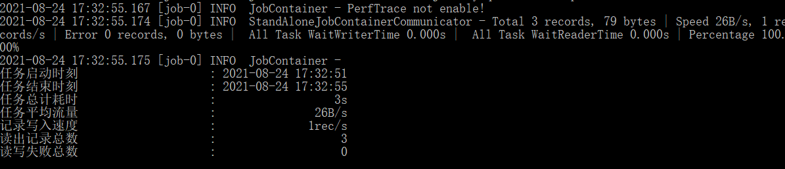
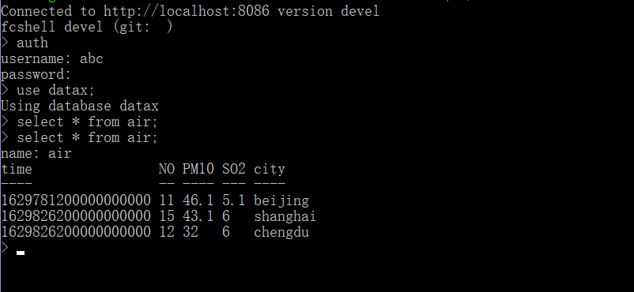
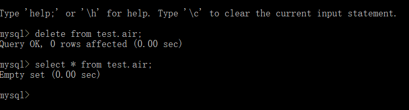
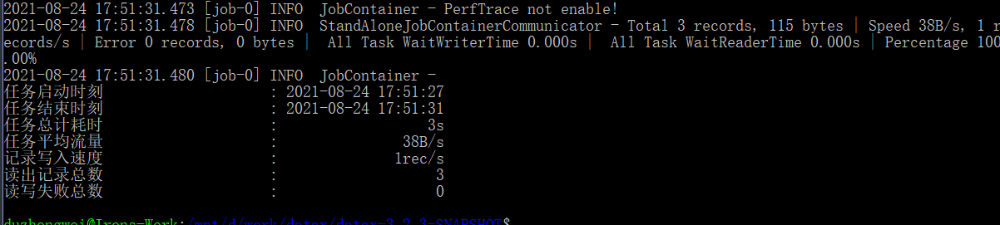
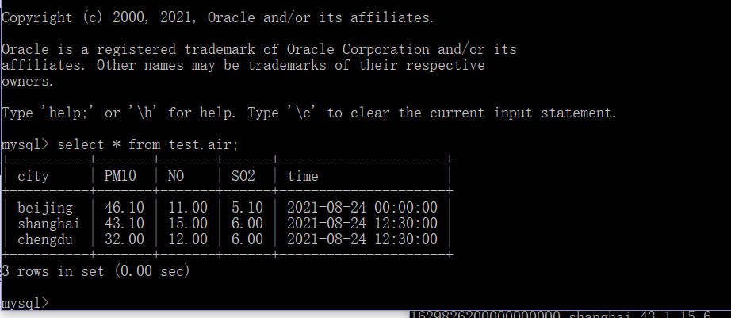

# MySQL与海东青互迁

# 环境搭建

注意：请**务必使用Java JRE 1.8**，其他版本可能会运行失败。

1. 安装Java JRE 1.8（即Java JRE8） ，下载地址：[https://www.oracle.com/java/technologies/javase-jre8-downloads.html](https://www.oracle.com/java/technologies/javase-jre8-downloads.html)。
1. 安装Python 2.7 （[https://www.python.org/download/releases/2.7/](https://www.python.org/download/releases/2.7/)）或Python 3.7（[https://www.python.org/downloads/release/python-370/](https://www.python.org/downloads/release/python-370/)）。
1. 从 [https://fctsdb.rockontrol.com/release/datax/](https://fctsdb.rockontrol.com/release/datax/) 下载最新版datax。

# 准备

因为使用案例展示从MySQL迁移到海东青以及从海东青迁移到MySQL，因此需要执行一些准备工作。

1. 安装并启动MySQL：参考 [https://www.digitalocean.com/community/tutorials/how-to-install-mysql-on-ubuntu-20-04](https://www.digitalocean.com/community/tutorials/how-to-install-mysql-on-ubuntu-20-04)
2. 使用 mysql -u root -p 进入mysql命令行，执行 create database test; 创建test数据库用于测试。
3. 执行

```sql
create table test.air
(
city varchar(20) ,
PM10 float(5,2),
NO float(5,2),
SO2 float(5,2),
time datetime
) default charset utf8;
```

创建test.air表用于准备测试数据。

4. 向test.air 表写入一些测试数据。譬如可以执行：

```sql
insert into test.air(city, PM10, NO, SO2, time) values('beijing', 46.1, 11, 5.1, '2021-08-24'),('chengdu', 32, 12, 6, '2021-08-24 12:30:00'),('shanghai', 43.1, 15, 6, '2021-08-24 12:30');
```

写入三条测试数据。

5. 启动海东青，并且在海东青数据库里创建datax数据库用于测试。

```sql
create database datax
```


# MySQL迁移到海东青

当准备工作完毕之后，就可以测试将MySQL里的数据迁移到海东青。

1. 将下载的datax包解压，会得到datax-3.2.3-SNAPSHOT目录（具体目录名根据版本而定），在datax-3.2.3-SNAPSHOT目录里新建mysql2fctsdb.json文件，并键入以下内容：

```json
{
        "job": {
                "setting": {
                        "speed": {
                                "channel": 1,
                                "bytes": -1,
                                "record": -1
                        }
                },
                "content": [{
                        "reader": {
                                "name": "mysqlreader",
                                "parameter": {
                                        "username": "root",
                                        "password": "111111",
                                        "column": [
                                                "city",
                                                "PM10",
                                                "NO",
                                                "SO2",
                                                "time"
                                        ],
                                        "connection": [{
                                                "jdbcUrl": ["jdbc:mysql://127.0.0.1:3306/test?useSSL=false"],
                                                "table": [
                                                        "air"
                                                ],
                                                "driver": "com.mysql.jdbc.Driver"
                                        }]
                                }
                        },
                        "writer": {
                                "name": "fctsdbwriter",
                                "parameter": {
                                        "connection": [{
                                                "endpoint": "http://localhost:8086",
                                                "database": "datax",
                                                "table": "air"
                                        }],
                                        "connTimeout": 15,
                                        "readTimeout": 20,
                                        "writeTimeout": 20,
                                        "username": "abc",
                                        "password": "Abc_123456",
                                        "column": [{
                                                        "name": "city",
                                                        "type": "TAG"
                                                },
                                                {
                                                        "name": "PM10",
                                                        "type": "float"
                                                },
                                                {
                                                        "name": "NO",
                                                        "type": "float"
                                                },
                                                {
                                                        "name": "SO2",
                                                        "type": "float"
                                                },
                                                {
                                                        "name": "time"
                                                }
                                        ],
                                        "batchSize": 1000
                                }
                        }
                }]
        }
}
```


此文件用以描述MySQL数据到海东青数据的映射关系和一些环境配置。

注意：以上账户密码或网络端口等配置根据实际情况可做修改。

2. 在 datax-3.2.3-SNAPSHOT目录，执行 python ./bin/datax.py ./mysql2fctsdb.json。即可完成将MySQL test 数据库的air表迁移到海东青数据库datax的air表里。



3. 在fcshell里检验数据：




（截图最后一次select之前的命令都是在执行迁移之前执行，确认没有数据。在执行迁移之后再执行一次SELECT以核实数据是否迁移成功，最后结果显示成功迁移了MySQL里的三条数据）


# 海东青迁移到MySQL

1. 先删除上一个测试中写入到MySQL的数据，并确认此时无数据。



2. 在datax-3.2.3-SNAPSHOT 里新建fctsdb2mysql.json 文件，键入以下内容：

```json
{
        "job": {
                "content": [{
                        "reader": {
                                "name": "fctsdbreader",
                                "parameter": {
                                        "column": [
                                                "time",
                                                "city",
                                                "PM10",
                                                "NO",
                                                "SO2"
                                        ],
                                        "connection": [{
                                                "endpoint": "http://localhost:8086",
                                                "database": "datax",
                                                "table": "air"
                                        }],
                                        "username": "abc",
                                        "password": "Abc_123456",
                                        "querySql": "select city,PM10,NO,SO2 from air"
                                }
                        },
                        "writer": {
                                "name": "mysqlwriter",
                                "parameter": {
                                        "username": "root",
                                        "password": "111111",
                                        "column": [
                                                "time",
                                                "city",
                                                "PM10",
                                                "NO",
                                                "SO2"
                                        ],
                                        "connection": [{
                                                "table": [
                                                        "air"
                                                ],
                                                "jdbcUrl": "jdbc:mysql://127.0.0.1:3306/test?useSSL=false"
                                        }]
                                }
                        }
                }],
                "setting": {
                        "speed": {
                                "bytes": -1,
                                "channel": 1
                        }
                }
        }
}
```


此文件用以描述海东青时序数据到MySQL表结构的映射关系。

3. 进入datax-3.2.3-SNAPSHOT目录，执行 python ./bin/datax.py ./fctsdb2mysql.json



4. 检验数据：



如上图所示，最终成功迁移了三条数据。