# Web控制台

# 介绍

海东青数据库控制台是数据库系统的可视化界面，包括概览信息、实例列表、数据库管理、用户管理、参数修改、SQL审计和证书管理等功能。

# 功能

## 2.1 登录页

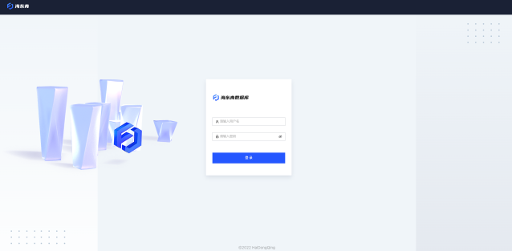

## 2.2 概览信息

展示数据库基础信息和系统监控信息。

**页面原型**

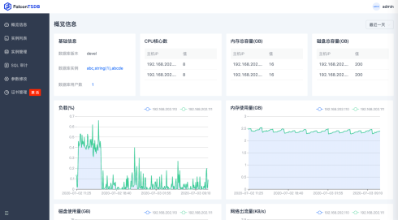

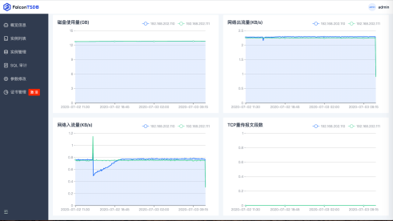

**操作说明**

|对象|	操作说明|
| ----------- | ----------- |
|刷新选择	|下拉框选择“最近一小时、最近一天、最近一周、最近一天”|

##  2.3 实例列表

**说明**

显示所有数据库实例的列表，展示字段：实例ID、实例名称、角色（leader\follower\learner）、状态和连接地址。

**页面原型**

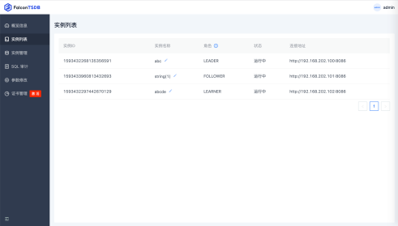

**角色说明**

| 对象	| 操作说明| 
| ----------- | ----------- |
| leader	| 可写可读，决定日志提交| 
| follower	| 只读，同步复制日志| 
| learner	| 只读，异步复制日志| 

**操作说明**

|对象|	操作说明|
| ----------- | ----------- |
|编辑实例名称|	编辑数据库实例名称|

## 2.4 实例管理

### 2.4.1 数据库管理

**说明**

显示当前主实例的所有数据库名称和数据库对应的存储策略信息，并且可以新增/删除/编辑数据库和存储策略，支持按照数据库名称模糊查询数据库。

**页面原型**

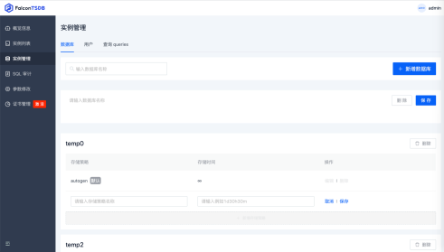

**操作说明**

| 对象	| 操作说明| 
| ----------- | ----------- |
| 新增数据库	| 运行工作流| 
| 删除数据库	| 停用后工作流不能按照运行策略自动运行| 
| 新增存储策略	| 新增数据库的存储策略，输入存储策略名称和存储时间| 
| 编辑存储策略	| 编辑创建的存储策略，可以编辑存储时间| 
| 删除存储策略	| 删除创建的存储策略| 

###  2.4.2 用户管理

**说明**

显示数据库所有用户列表，支持新增用户、修改用户密码、设置用户权限和删除已经创建的用户。

**页面原型**

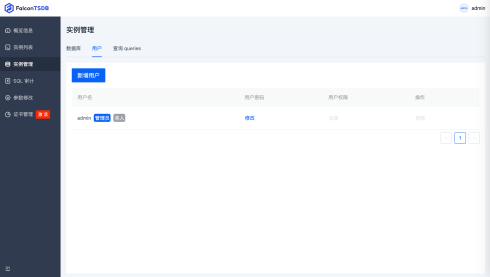

**操作说明**

|对象	|操作说明|
| ----------- | ----------- |
|新增用户	|新增用户，输入用户名和密码、密码确认|
|删除用户	|删除已创建的用户|
|修改用户密码	|修改已创建用户的密码|
|设置用户权限	|给数据库级别赋用户权限，权限选项包括：read、write、all、none|

###  2.4.3 查询queries

**说明**

显示数据库所有正在执行的操作，展示字段：数据库名、SQL、运行时间和操作。

**页面原型**

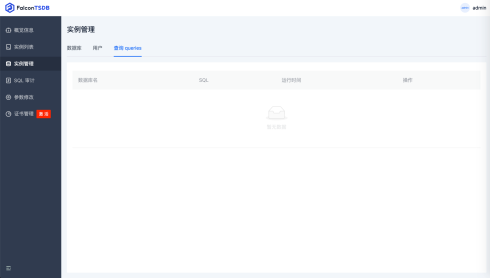

**操作说明**

|对象	|操作说明|
| ----------- | ----------- |
|Kill	|结束正在执行的sql|

##  2.5 SQL审计

**说明**

显示sql审计的所有数据列表，展示字段：地址、数据库、用户、角色、耗时、操作时间、事件类型、查询结果和操作，支持导出查询的数据，可以筛选展示的字段。

**页面原型**

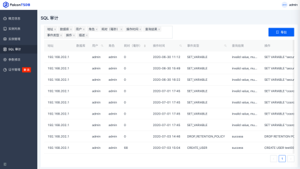

**查询说明**

|对象	|说明|
| ----------- | ----------- |
|用户查询|	按照用户名模糊查询|
|事件类型查询	|下拉框展示事件类型，按照事件类型筛选数据|
|操作时间	|根据开始时间和结束时间筛选数据|

**操作说明**

|对象	|操作说明|
| ----------- | ----------- |
|导出	|导出筛选的数据到excel|

##  2.6 参数修改

**说明**

显示所有可以修改的数据库参数列表，字段展示：参数名称、是否需重启、参数值、允许值和描述。

**页面原型**

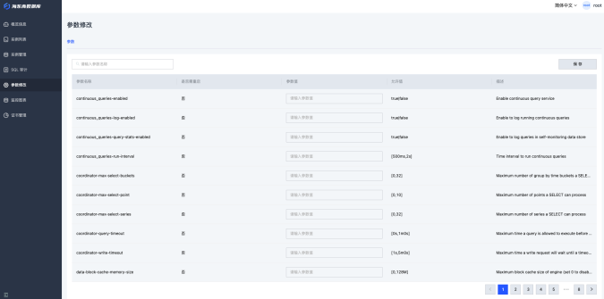

**查询说明**

|对象	|说明|
| ----------- | ----------- |
|参数名称查询	|输入参数名称模糊查询|

**操作说明**

|对象	|操作说明|
| ----------- | ----------- |
|保存	|保存修改的参数值|

## 2.7 证书管理

**说明**

支持加载证书，并且展示已经加载的证书列表。

**页面原型**

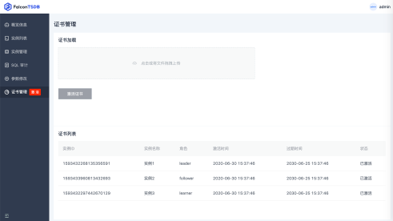

## 2.8 看板管理

**说明**

支持从数据库获取数据生成可视化图表进行查看

**页面原型**

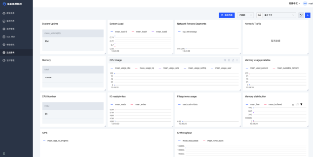

