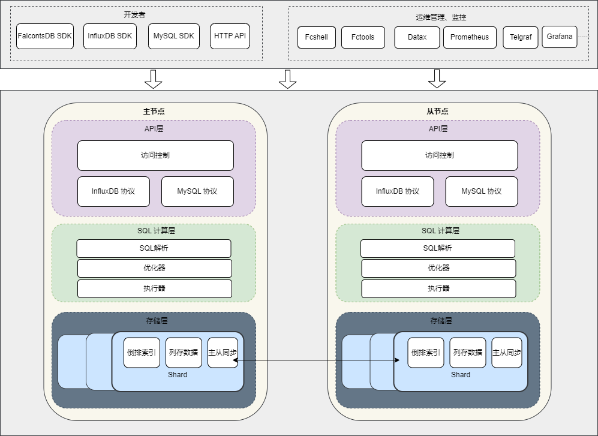

# 系统架构

### 开发者

开发者可以使用海东青FalcontsDB SDK、InfluxDB SDK、MySQL SDK以及HTTP API操作海东青进行数据写入和数据分析查询。

### 运维管理、监控

运维可以使用海东青命令行工具Fcshell、Fctools操作海东青（可以进行数据库管理、读写数据、数据备份等操作），可以使用第三方数据迁移工具Datax将其他数据据数据迁移到海东青或者将海东青数据迁移到其他数据库。海东青内置提供Prometheus协议的接口，暴露监控数据，Prometheus可以直接接入海东青。

此外，海东青支持运维部署Telgraf接入海东青，也支持使用Grafna可视化展示海东青的数据。

### 海东青主程序

海东青主程序提供API访问、SQL计算层、数据存储。 API访问包括通信协议的处理和授权访问控制相关功能。

SQL计算层则包括了SQL的解析、优化器（用于选择最佳的物理计划）、执行器（部分采用并行、向量化计算），这是海东青数据库进行数据分析的核心。

海东青存储层则实现按照时间分片的列式存储引擎。其层次结构如下（从最顶层到最下层）：

   - DB

  	海东青的多个逻辑DB分开存储。每个DB下包含多个RP（过期策略）。
   - RP

    每个RP表示某种过期策略，按照不同的过期策略管理其数据。默认每个DB都含有一个名为autogen的RP。每个RP下包含多个Shard。

   - Shard

  	一个Shard表示一个时间范围的数据，它由多份TSM数据文件、多份TSI倒排索引文件组成。一个Shard包含多个measurement（表）的数据。

海东青节点有两种类型：leader和follower。 leader为主节点，可写可读，follower则为从节点，只允许读不允许写。

主从之间按照Shard为单位进行主从同步（即各个shard进行各自独立的同步逻辑和管理）。