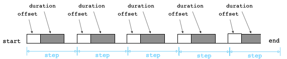

# 数据查询

# 基础Select语句

海东青支持的SQL语法规则为如下：

```sql
select_stmt=select [distinct] fields [from_clause] [into_clause] [where_clause] 
[group_by_clause] [fill_clause] [having_clause] [order_by_clause] [limit_clause] [tz_clause]
```

## Select从句

* Select *：返回数据源from_clause中的所有数据
* Select 1,1+2,...：无数据源的Select从句
* Select field1,field2,..,：其中fieldm可以是from_clause数据源中的列名、常量、*，以及对from_clause数据源中的一些列的运算操作，例如：四则运算操作，函数操作，比较操作等。
* Select field1,field2 as alias1,...：还可以对一些field取别名

## TZ从句

`tz('<time_zone>')` 可以指定当前查询语句使用的时区，用于查询语句中时间字符串的解析以及查询结果中time列的格式化。

比如 可以在查询语句中指定使用上海时区：`select * from table tz('Asia/Shanghai')`。
`time_zone`可使用的时区名称请参考[List_of_tz_database_time_zones](https://en.wikipedia.org/wiki/List_of_tz_database_time_zones#List)。

## From从句

* From table_name：直接从存储层中的表中获取数据源
* From (select_stmt) [as table_alias]：子查询结果作为外层select语句的数据源

## Where从句

语法格式为：where condition_expr

where从句就是从数据源中过滤出数据出来，因此where从句所出现的列名必须来源于数据源中。

## Group从句

语法格式为：`group by filed1[,field2,....]`

对数据进行分组，分组的项可以是数据源中的列名，以及数据源中关于一些列名的计算操作，以及Select从句中的别名。注意匹配规则有优先顺序的，Select从句中的别名是最后判断的。

Group从句和Select从句配合起来形成了三种不同分组查询：

1. 分组聚合查询。例如`select sum(a) from table group by c`
1. 分组筛选查询。例如`select top(a),b from table group by c`
1. 分组不聚合查询。例如`select a,b from table group by c`，此语句会返回table的所有数据，并按照c列值进行分组，不同分组的数据不会交叉返回。

### 时间分组

Group从句可以通过时间分组函数Window/time，实现按时间段进行分组。  
Window的语法格式为： `window(step, [duration], [offset])`
- step: &nbsp;&nbsp;&nbsp;&nbsp;&nbsp;&nbsp; 分组步长
- duration: 分组大小，可选，默认 duration = step
- offset:  &nbsp;&nbsp;&nbsp;&nbsp; 以 step 为基准的偏移量，可选，默认 0

time是window的简化版，语法格式为：`time(step, [offset])`，其等价于`window(step, [offset])`。 




时间分组函数是Group从句独有的函数，在一个Group从句中只能出现一次；时间分组函数也可以和其他列一同进行分组。

- 示例
    ```sql
        > select * from h2o_feet;
        name: h2o_feet
        +----------------------+--------------+-------------+
        | time                 | location     | water_level |
        +----------------------+--------------+-------------+
        | 2019-08-18T00:30:00Z | santa_monica | 2.267       |
        | 2019-08-18T00:24:00Z | santa_monica | 2.264       |
        | 2019-08-18T00:18:00Z | santa_monica | 2.329       |
        | 2019-08-18T00:12:00Z | santa_monica | 9.343       |
        | 2019-08-18T00:06:00Z | santa_monica | 2.379       |
        | 2019-08-18T00:00:00Z | santa_monica | 2.352       |
        | 2019-08-18T00:30:00Z | coyote_creek | 8.012       |
        | 2019-08-18T00:24:00Z | coyote_creek | 8.13        |
        | 2019-08-18T00:18:00Z | coyote_creek | 8.225       |
        | 2019-08-18T00:12:00Z | coyote_creek | 8.32        |
        | 2019-08-18T00:06:00Z | coyote_creek | 8.419       |
        | 2019-08-18T00:00:00Z | coyote_creek | 8.504       |
        +----------------------+--------------+-------------+
        12 rows in set (0.00 sec)
        > select time,location,top(water_level, 1) from h2o_feet group by window(12m);
        name: h2o_feet
        +----------------------+--------------+---------------------+
        | time                 | location     | top(water_level, 1) |
        +----------------------+--------------+---------------------+
        | 2019-08-18T00:24:00Z | coyote_creek | 8.13                |
        | 2019-08-18T00:12:00Z | santa_monica | 9.343               |
        | 2019-08-18T00:00:00Z | coyote_creek | 8.504               |
        +----------------------+--------------+---------------------+
        3 rows in set (0.00 sec)
        > select time,max(water_level),location from h2o_feet group by window(12m),location;
        name: h2o_feet
        tags: location=coyote_creek
        +----------------------+------------------+--------------+
        | time                 | max(water_level) | location     |
        +----------------------+------------------+--------------+
        | 2019-08-18T00:24:00Z | 8.13             | coyote_creek |
        | 2019-08-18T00:12:00Z | 8.32             | coyote_creek |
        | 2019-08-18T00:00:00Z | 8.504            | coyote_creek |
        +----------------------+------------------+--------------+

        name: h2o_feet
        tags: location=santa_monica
        +----------------------+------------------+--------------+
        | time                 | max(water_level) | location     |
        +----------------------+------------------+--------------+
        | 2019-08-18T00:24:00Z | 2.267            | santa_monica |
        | 2019-08-18T00:12:00Z | 9.343            | santa_monica |
        | 2019-08-18T00:00:00Z | 2.379            | santa_monica |
        +----------------------+------------------+--------------+
        6 rows in set (0.00 sec)
    ```

&nbsp;&nbsp;&nbsp;&nbsp;\* 以上示例中，time列表示每个window的起始点，不是max(water_level)的时间点。


## Fill从句

fill从句的语法格式为：`fill null | previous | linear`

Fill从句的目的是当window分组聚合若出现空值时，则该时间段的聚合之就用fill规定的直来填充。

## Having 从句

having从句的语法格式为：`having condition_expr`

Having从句目的是对分组后的数据进行过滤

## Distinct关键字

distinct关键字主要是对数据去重，由于Group从句和Select从句组合产生三种分组。因此根据业务需要去重规则有两种：

1. 组内去重：
1. 全局排序：组内去重除外的所有情况

## OrderBy从句

orderby从句的语法格式为：`order by field1 asc|desc[,field2 asc|desc...]`

Orderby从句目的是对数据进行排序。分组的项可以是列名，也可以是一些列名的运算结果。其中注意的是列名匹配存在优先级，先匹配select从句输出的名字，没有匹配上匹配数据源中的列名。

由于Group从句和Select从句组合产生三种分组。因此根据业务需要OrderBy有两种规则：

1. 组内排序：
1. 全局排序：组内排序除外的所有情况


## Limit从句

limit从句的语法格式为：`limit a`或`limit b,a`

Limit从句目的是限制取出的数据的行数。

同OrderBy从句一样，Limit也存在两个规则：组内limit和组外limit。两种规则命中规则和order by一样。

## Into从句

Into从句的语法格式为：into table_name

Into从句目的是将一个Select查询的结果存入到另外一张表中。

注意Into从句能够执行要求是Select查询输出的列名都必须在Into从句中table_name的表中，且类型需要对应应。

# 从句执行顺序

上述将一个SQL语句拆分成好几个从句。下面说一般情况下这些从句执行的优先顺序：

1. From从句
1. Where从句
1. GroupBy从句
1. Fill从句
1. Having从句
1. Select从句
1. Distinct关键字
1. OrderBy从句
1. Limit从句
1. Into从句


